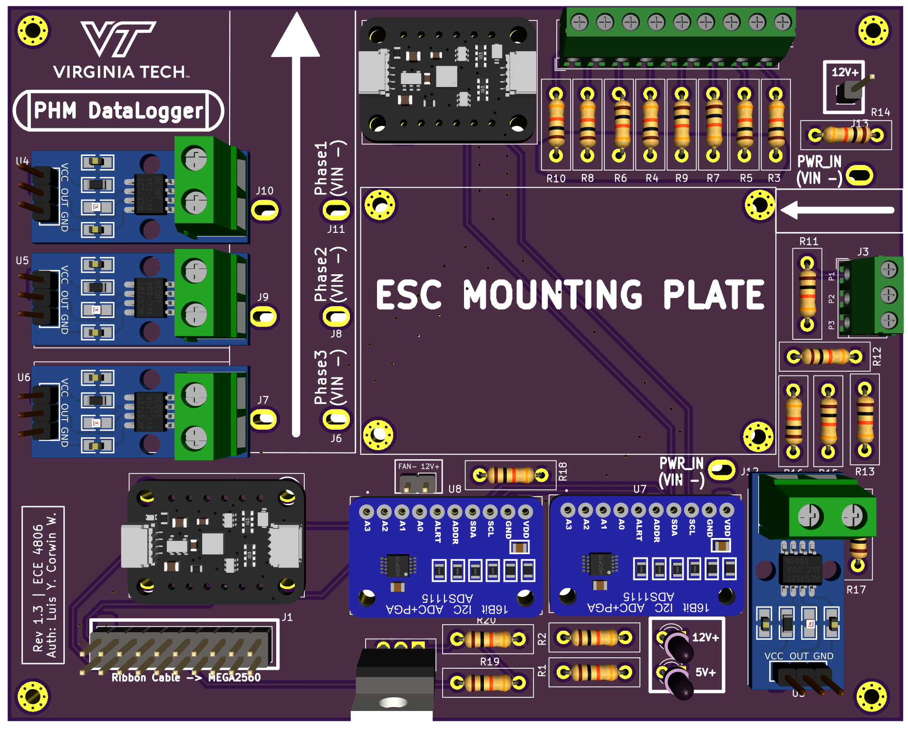

# Prognosticative Health Monitoring Of Power Electronic Converters
## Via Coffin-Manson Equation Modeling & Analysis

This repository houses the hardware and software required for the operation of our senior design deliverable. In essense, the project aims to complete 3 major Objectives: 

- Create a Prognostic Health Monitor for a Power Electronic Converter (PEC) to predict the expected fialures fo the components of interest. 
- The product to be delivered will predict dysfunctional operation with the advanced scheduling of maintenance
- The product to be delivered will predict the lifetime span of the PEC from the component-analysis including internal system parameters and external system parameters.

Main code is held in a dedicated arduino.ino script named: "ESC_CONTROLLER_CODE" 
Hardware files for our datalogger unit (acts as the data acquisition device for MOSFET parameters) is held as a kiCAD project file in the filepath: "Datalogger_Hardware"

</img>

Additional research and design files are held in our dedicated team google drive as well as course specfiic documentation and can be given upon request. 
